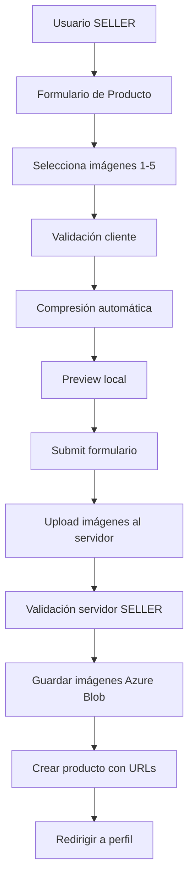

# 🎉 Implementación del Rol SELLER y Creación de Productos

## 📋 Resumen de Cambios

Se ha implementado exitosamente el rol de **SELLER (Vendedor)** en el sistema, permitiendo que usuarios vendedores puedan crear productos con imágenes optimizadas y validadas.

---

## ✨ Características Implementadas

### 1. **Registro con Selección de Rol** 
- ✅ Actualizado el formulario de registro para incluir selección entre roles:
  - `USER` (Comprador)
  - `SELLER` (Vendedor)
- ✅ Tipos TypeScript actualizados para incluir el rol SELLER
- ✅ Validación del rol en el schema de registro

**Archivos modificados:**
- `front-next/src/app/auth/register/page.tsx`
- `front-next/src/features/auth/types/auth.types.ts`
- `front-next/src/features/auth/hooks/useAuth.ts`

---

### 2. **Sistema de Carga de Imágenes Profesional**

Implementado un componente robusto de carga de imágenes con:

#### **Validaciones de Seguridad** 🔒
- ✅ Máximo 5 imágenes por producto
- ✅ Tamaño máximo por archivo: 5MB
- ✅ Tamaño total máximo: 20MB
- ✅ Tipos permitidos: `image/jpeg`, `image/png`, `image/webp`
- ✅ Validación en cliente y servidor

#### **Optimización de Rendimiento** ⚡
- ✅ Compresión automática de imágenes
- ✅ Redimensionamiento inteligente (máx 2048px)
- ✅ Calidad de compresión: 85%
- ✅ Preview en tiempo real
- ✅ Carga progresiva

#### **Experiencia de Usuario** 💎
- ✅ Drag & Drop de imágenes
- ✅ Preview visual con miniaturas
- ✅ Indicador de tamaño de archivos
- ✅ Contador de imágenes (X/5)
- ✅ Mensajes de error descriptivos
- ✅ Loading states durante compresión
- ✅ Posibilidad de eliminar imágenes

**Archivos creados:**
- `front-next/src/components/ImageUpload.tsx`
- `front-next/src/config/imageUpload.ts`
- `front-next/src/utils/imageUtils.ts`

---

### 3. **Página de Creación de Productos** 📦

Formulario completo y profesional para que vendedores creen productos:

#### **Campos del Formulario:**
- ✅ Nombre del producto (min 3 caracteres)
- ✅ Descripción (min 10 caracteres)
- ✅ Precio en USD (mayor a 0)
- ✅ Categoría (cargada dinámicamente desde backend)
- ✅ Imágenes del producto (1-5 imágenes)

#### **Validaciones:**
- ✅ Validación con Zod schema
- ✅ Mensajes de error específicos
- ✅ Validación en tiempo real
- ✅ Prevención de envío si faltan datos

#### **Seguridad:**
- ✅ Hook `useSellerGuard` para proteger la ruta
- ✅ Redirección automática si no es SELLER
- ✅ Autenticación requerida

**Archivos creados:**
- `front-next/src/app/seller/create-product/page.tsx`
- `front-next/src/app/seller/create-product/layout.tsx`
- `front-next/src/hooks/useSellerGuard.ts`
- `front-next/src/services/product.service.ts`

---

## 🎨 Diseño UI/UX

### **Estilo Visual:**
- ✅ Diseño limpio y profesional
- ✅ Paleta de colores consistente con Amazon (amarillo/gris)
- ✅ Iconos de Lucide React
- ✅ Responsive design
- ✅ Sombras y bordes sutiles
- ✅ Estados hover y focus

### **Accesibilidad:**
- ✅ Labels asociados a inputs
- ✅ Mensajes de error descriptivos
- ✅ Indicadores visuales claros
- ✅ Teclado navegable
- ✅ ARIA labels en botones

---

## 🔧 Arquitectura Técnica

### **Frontend Stack:**
```
- Next.js 14 (App Router)
- TypeScript
- React Hook Form + Zod
- TanStack Query (React Query)
- Tailwind CSS
- Lucide Icons
```

### **Flujo de Creación de Producto:**



### **Validaciones en Capas:**

1. **Cliente (TypeScript/Zod):**
   - Validación de tipos de archivo
   - Validación de tamaños
   - Validación de cantidad
   - Validación de campos del formulario

2. **Servidor (Java/Spring):**
   - Verificación de rol SELLER
   - Re-validación de tipos MIME
   - Re-validación de tamaños
   - Re-validación de cantidad
   - Protección contra bypass

---

## 📦 Configuración de Límites

Basado en el archivo `.env` del backend:

```typescript
const PRODUCT_IMAGE_CONFIG = {
  MAX_FILE_SIZE: 5 * 1024 * 1024,      // 5MB
  MAX_FILES_COUNT: 5,                   // 5 archivos
  MAX_TOTAL_SIZE: 20 * 1024 * 1024,    // 20MB total
  ALLOWED_TYPES: ['image/jpeg', 'image/png', 'image/webp'],
  COMPRESSION_QUALITY: 0.85,            // 85%
  MAX_DIMENSION: 2048                   // 2048px
};
```

---

## 🚀 Rutas Implementadas

### **Nuevas Rutas:**
- `GET /seller/create-product` - Página de creación de producto (protegida, solo SELLER)

### **Rutas Modificadas:**
- `POST /auth/register` - Ahora acepta el campo `role` (USER o SELLER)

### **APIs Utilizadas:**
- `POST /api/v1/products/images` - Upload de imágenes (requiere rol SELLER)
- `POST /api/v1/products` - Crear producto
- `GET /api/v1/categories` - Obtener categorías

---

## 🔐 Seguridad Implementada

### **Autenticación y Autorización:**
1. ✅ Solo usuarios autenticados pueden acceder
2. ✅ Solo usuarios con rol SELLER pueden crear productos
3. ✅ Verificación de rol en backend para upload de imágenes
4. ✅ Guard personalizado `useSellerGuard`

### **Validación de Archivos:**
1. ✅ Whitelist de tipos MIME
2. ✅ Límites de tamaño estrictos
3. ✅ Validación de extensiones
4. ✅ Sanitización de nombres de archivo

### **Protección XSS:**
1. ✅ Validación de inputs con Zod
2. ✅ Escape automático de React
3. ✅ CSP headers (configurar en producción)

---

## ⚡ Optimización de Rendimiento

### **Carga de Imágenes:**
- ✅ Compresión automática antes de upload
- ✅ Redimensionamiento para reducir payload
- ✅ Preview local sin round-trip al servidor
- ✅ Carga paralela de múltiples imágenes

### **Formulario:**
- ✅ Validación lazy (solo al submit inicial)
- ✅ Debounce en validaciones
- ✅ Loading states claros
- ✅ Prevención de doble submit

### **Queries:**
- ✅ React Query para cache de categorías
- ✅ Invalidación automática de cache
- ✅ Retry automático en fallos

---

## 📱 Responsive Design

El diseño es completamente responsive:

- ✅ Mobile-first approach
- ✅ Grid adaptativo para previews
- ✅ Formulario adaptable
- ✅ Touch-friendly en móviles
- ✅ Drag & Drop en desktop

**Breakpoints:**
- Mobile: < 640px
- Tablet: 640px - 1024px
- Desktop: > 1024px

---

## 🧪 Testing Recomendado

### **Tests Unitarios:**
```typescript
// Validaciones de imágenes
- validateImageFile() con diferentes tipos
- validateImageFiles() con diferentes cantidades
- compressImage() con diferentes tamaños

// Componente ImageUpload
- Renderizado correcto
- Drag & Drop funcional
- Eliminación de imágenes
- Manejo de errores

// Formulario CreateProduct
- Validaciones de campos
- Submit con datos válidos
- Manejo de errores de API
```

### **Tests de Integración:**
```typescript
- Flujo completo de creación de producto
- Upload de imágenes exitoso
- Redirección después de crear
- Protección de ruta solo SELLER
```

### **Tests E2E:**
```typescript
- Registro como SELLER
- Login como SELLER
- Crear producto completo
- Verificar producto creado
```

---

## 📝 Próximos Pasos Sugeridos

### **Mejoras Futuras:**
1. ⭐ Edición de productos existentes
2. ⭐ Lista de productos del vendedor en perfil
3. ⭐ Estadísticas de ventas
4. ⭐ Notificaciones de nuevos pedidos
5. ⭐ Gestión de inventario
6. ⭐ Descuentos y promociones
7. ⭐ Reordenamiento de imágenes (drag & drop)
8. ⭐ Crop de imágenes antes de upload
9. ⭐ Soporte para videos del producto
10. ⭐ Variantes de producto (tallas, colores)

### **Optimizaciones Adicionales:**
1. 🚀 Lazy loading de imágenes en grid
2. 🚀 Service Worker para cache de imágenes
3. 🚀 WebP conversion automática
4. 🚀 Progressive image loading
5. 🚀 CDN para imágenes

---

## 🎯 Checklist de Implementación

- [x] Actualizar tipos de autenticación con rol SELLER
- [x] Modificar formulario de registro
- [x] Crear configuración de límites de imágenes
- [x] Implementar utilidades de validación de imágenes
- [x] Crear componente ImageUpload con preview
- [x] Implementar compresión de imágenes
- [x] Crear servicio de productos
- [x] Implementar página de creación de productos
- [x] Crear guard de protección para SELLER
- [x] Integrar con API de categorías
- [x] Implementar manejo de errores
- [x] Agregar loading states
- [x] Implementar diseño responsive
- [x] Documentar código
- [x] Crear este README

---

## 💡 Consejos de Uso

### **Para Vendedores:**
1. Usa imágenes de alta calidad (mínimo 800x800px)
2. Agrega múltiples ángulos del producto (3-5 imágenes)
3. Asegúrate que la primera imagen sea la más representativa
4. Comprime manualmente imágenes muy grandes antes de subirlas
5. Usa fondos blancos o neutros para mejor presentación

### **Para Desarrolladores:**
1. Las imágenes se comprimen automáticamente en el cliente
2. El componente ImageUpload es reutilizable
3. Las validaciones están centralizadas en `imageUtils.ts`
4. Los límites se configuran en `imageUpload.ts`
5. El servicio de productos maneja automáticamente la autenticación

---

## 🐛 Troubleshooting

### **Error: "Access Denied: Only SELLER can upload"**
- Verificar que el usuario tenga rol SELLER
- Verificar que el token JWT sea válido
- Verificar headers de autenticación

### **Error: "Too many files"**
- Máximo 5 imágenes permitidas
- Eliminar imágenes antes de agregar más

### **Error: "File too large"**
- Máximo 5MB por archivo
- Comprimir imagen externamente primero

### **Error: "Invalid file type"**
- Solo JPG, PNG, WEBP permitidos
- Convertir imagen al formato correcto

---

## 📞 Soporte

Para preguntas o problemas:
1. Revisar la consola del navegador
2. Verificar logs del servidor
3. Revisar configuración de .env
4. Verificar permisos de usuario

---

## ✅ Conclusión

Se ha implementado exitosamente un sistema robusto, seguro y optimizado para que usuarios con rol SELLER puedan crear productos con imágenes. El sistema incluye:

- ✅ **Seguridad:** Validaciones en cliente y servidor, protección de rutas
- ✅ **Rendimiento:** Compresión automática, preview local, carga optimizada
- ✅ **UX:** Interfaz intuitiva, drag & drop, feedback visual
- ✅ **Mantenibilidad:** Código limpio, tipado fuerte, componentes reutilizables

¡Todo listo para que los vendedores empiecen a publicar productos! 🎉
